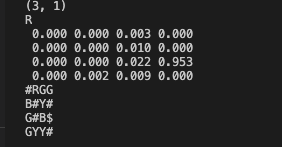

## Satch Baker
## COSC76 20F
## November 8th, 2022
## Quattrini Li

## PA6 Writeup

## Description
For implementing my algorithm, I generated three different matrices. The first matrix was my transition matrix. The transition matrix was an n * n matrix where an entry ij, i and j being positions on the maze, was the probability that you go from state i to state j. The second matrix that I had was 4 different n * n observation matrices, one for each possible tile color, mapping the probability that you observe a given color, at each point in the maze. My third matrix was an n * 1 matrix where each entry was the probability that the robot was at a given spot in the maze. The transition and observation matrices are static, but the probability matrix changed as the algorithm ran, updating based on outcomes of the observations and moves. Each step of the algorithm has a randomly initialized robot step and make an observation. We then multiply the observation matrix of that observed color with the transition matrix and the probabilities array, to generate the new probabilities array. 

## Results
My algorithms work well, as you can see when you run the program, we can get an estimate of where the robot is in the 90th percentile at points. One thing that hinders the ability to make accurate predictions of where we are is when the robot makes a faulty observation or more along the path. Below is the output over 10 iterations of the algorithm, the top array showing probability distributions for each spot, and the maze below with the actual location of the robot.
